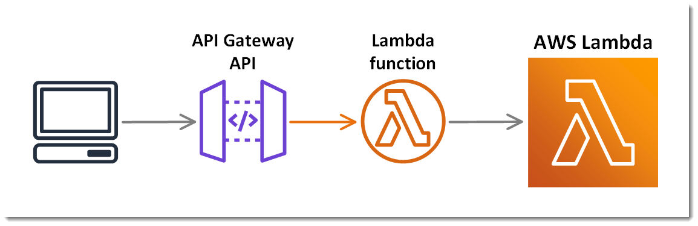
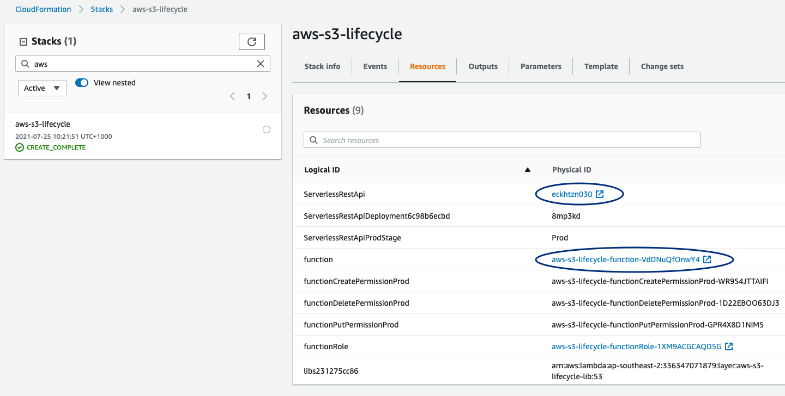
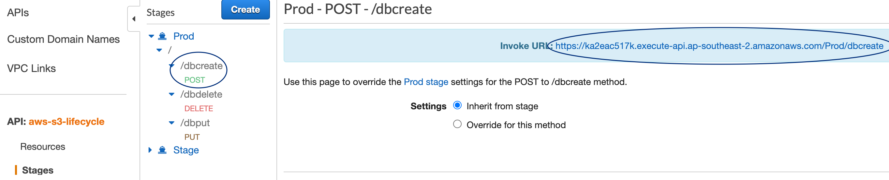
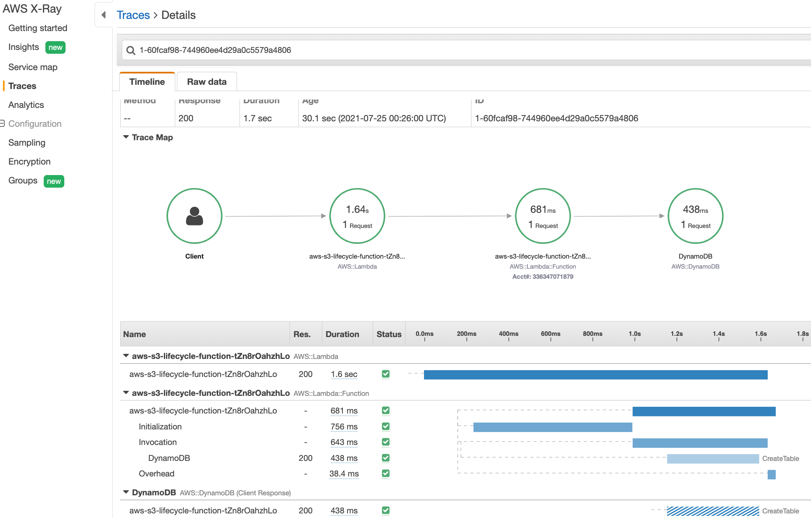

# aws-app-challenge
This is a response to to the aws-app-challenge detailed [here](https://github.com/tnh/interviews/blob/main/aws-app/README.md).

# Design
We will be creating an api service to provide DynamoDB lifecycle.  The solution consist of AWS API Gateway and Lambda 
accompanied by CloudWatch and XRay for observability.



# Setup
## Prerequisites

* python is installed on your deployment machine([pyenv](https://github.com/pyenv/pyenv))

## Deployment

1. `make build-deploy`
2. View aws resource created
    

## Invoke endpoints

1. Go to api gateway and look for url endpoints
    
2. Run curl command for create, update and delete of DynamoDB table, sample calls:
    ```
    # To create a table
    curl -d "@./sample-payload/create.json" -X POST https://eckhtzn030.execute-api.ap-southeast-2.amazonaws.com/Prod/dbcreate

    # To update a table
    curl -d "@./sample-payload/update.json" -X PUT https://eckhtzn030.execute-api.ap-southeast-2.amazonaws.com/Prod/dbput

    # To delete a table
    curl -d "@./sample-payload/delete.json" -X DELETE https://eckhtzn030.execute-api.ap-southeast-2.amazonaws.com/Prod/dbdelete
    ```
3. (optional) View trace
    

## Clean up

1. `make clean-up`
